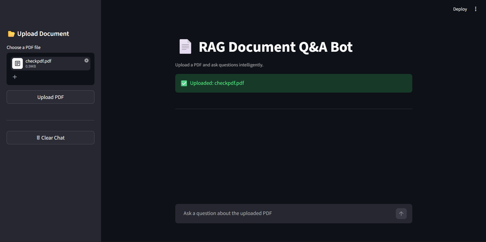
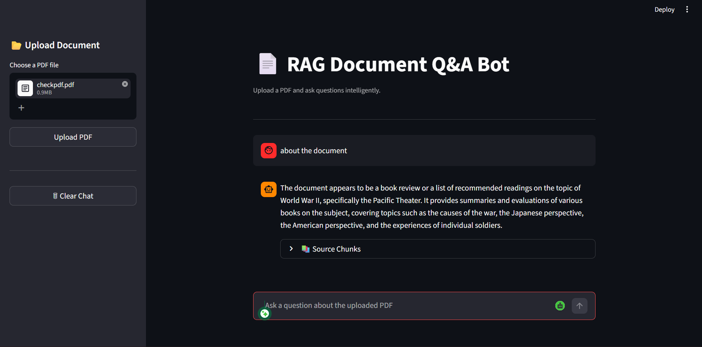
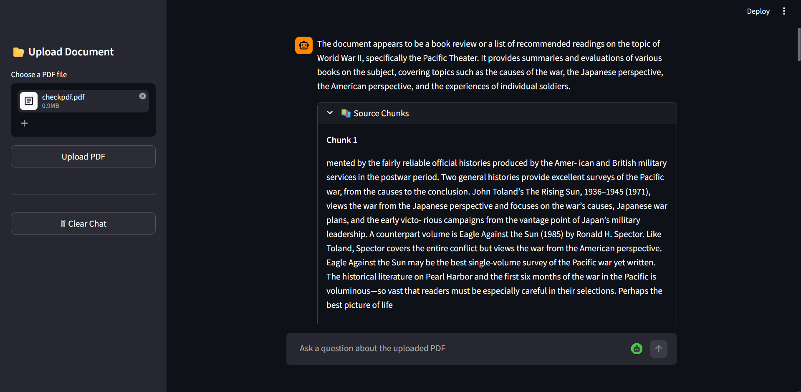

# 📄 RAG-Based Document Q&A Bot

An AI-powered document question-answering system built using Retrieval-Augmented Generation (RAG).  
Users can upload PDF documents and ask natural language questions to receive contextual answers directly from the document content.

---

# 🚀 Features

- PDF upload and processing
- Intelligent document-based question answering
- Semantic search using vector embeddings
- FAISS vector database integration
- Chat-style user interface
- Context-aware response generation
- Source chunk display for transparency
- FastAPI backend with Streamlit frontend

---

# 🧠 Tech Stack

| Category | Technology |
|---|---|
| Language | Python |
| Backend | FastAPI |
| Frontend | Streamlit |
| Embedding Model | SentenceTransformers |
| Vector Database | FAISS |
| LLM API | Groq API |
| PDF Processing | PyMuPDF |
| AI Technique | Retrieval-Augmented Generation (RAG) |

---

# ⚙️ System Architecture

```text
User Uploads PDF
        ↓
Text Extraction
        ↓
Chunking
        ↓
Embedding Generation
        ↓
FAISS Vector Storage
        ↓
Semantic Retrieval
        ↓
Groq LLM Response Generation
        ↓
Answer Display
```

---

# 📂 Project Structure

```text
rag-doc-bot/
│
├── app/
│   ├── main.py
│   ├── rag_bot.py
│   ├── pdf_utils.py
│   ├── text_splitter.py
│   └── embeddings.py
│
├── data/
├── uploads/
├── streamlit_app.py
├── README.md
├── .gitignore
└── requirements.txt
```

---

# 🛠️ Installation

## Clone Repository

```bash
git clone <your-repository-link>
cd rag-doc-bot
```

## Create Virtual Environment

```bash
python -m venv venv
```

## Activate Virtual Environment

### Windows

```bash
venv\Scripts\activate
```

## Install Dependencies

```bash
pip install -r requirements.txt
```

---

# 🔑 Environment Variables

Create a `.env` file in the root directory:

```env
GROQ_API_KEY=your_api_key_here
```

---

# ▶️ Run Backend

```bash
python -m uvicorn app.main:app --reload
```

---

# ▶️ Run Frontend

```bash
streamlit run streamlit_app.py
```

---

# 💬 Example Questions

- What is this document about?
- What technologies are used in the project?
- Summarize the objective section
- What skills are mentioned?
- Explain the methodology

---

# 📸 Screenshots

## Main Interface



---

## Chat-Based Question Answering



---

## Source Chunk Retrieval



---


# 🔮 Future Improvements

- Multi-PDF support
- Persistent vector database
- Conversation memory
- Authentication system
- Cloud deployment
- Improved retrieval reranking

---

# 👨‍💻 Author

**Yogesh Kanna**

- LinkedIn: https://linkedin.com/in/yogeshkannaai
- GitHub: https://github.com/yogeshkanna-ai
- Email: kannayogesh865@gmail.com